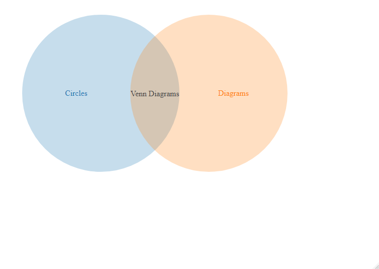

# d3Venn

## Introduction

The `d3Venn` package is a wrapper, or [htmlwidget](http://www.htmlwidgets.org/), for
[venn.js](https://github.com/upsetjs/venn.js).

There is already the package (https://github.com/timelyportfolio/d3vennR) doing basically 
the same. However, the code there is not maintained anymore and uses partially legacy code
from [htmlwidget](http://www.htmlwidgets.org/).

The `D3` library has a rich interface for changing the look and feel of the generated 
plots. This package **does not** provide any functionality to mingle with the `D3`
framework itself (refer to 
[r2d3](https://blog.rstudio.com/2018/10/05/r2d3-r-interface-to-d3-visualizations/) if you
are looking for this functionality), but purely provide a widget for Venn diagrams.

## Installation

```r
remotes::install_github("thothal/d3Venn")
```

## Basic Usage

```r
d3Venn(data.frame(sets  = I(list("A", "B", list("A", "B"))),
                  size  = c(10, 10, 2),
                  label = c("Circles", "Diagrams", "Venn Diagrams")))
```


